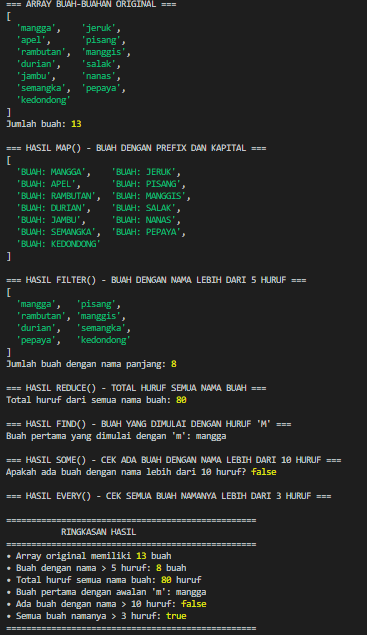

# Tugas Array Methods - Week 5

## Identitas

-   Nama : [Nama Lengkap]
-   NIM : [NIM Mahasiswa]

## Deskripsi Tugas

Tugas ini bertujuan untuk memahami dan mengimplementasikan berbagai method array JavaScript menggunakan data buah-buahan. Setiap method memiliki fungsi dan tujuan yang berbeda dalam manipulasi data array.

### Tujuan Pembelajaran:

1. Memahami cara kerja method array JavaScript
2. Menerapkan konsep functional programming
3. Menganalisis perbedaan fungsi setiap method
4. Melatih kemampuan problem solving dengan array

## Method yang Digunakan

### 1. Array Original

-   **Deskripsi**: Array `buahBuahan` dengan 13 elemen buah Indonesia
-   **Tujuan**: Menyediakan data dasar untuk dimanipulasi oleh method lainnya
-   **Detail**: Semua nama buah menggunakan huruf kecil untuk konsistensi

### 2. map()

-   **Deskripsi**: Mengubah semua nama buah menjadi huruf kapital dengan prefix "BUAH:"
-   **Tujuan**: Memahami transformasi data tanpa mengubah array original
-   **Kegunaan**: Membuat array baru dengan format yang berbeda

### 3. filter()

-   **Deskripsi**: Memfilter buah yang namanya lebih dari 5 huruf
-   **Tujuan**: Mempelajari cara menyaring data berdasarkan kondisi tertentu
-   **Hasil**: 8 buah dari 13 buah original

### 4. reduce()

-   **Deskripsi**: Menghitung total karakter dari semua nama buah
-   **Tujuan**: Memahami agregasi data menjadi satu nilai tunggal
-   **Hasil**: 80 karakter total

### 5. find()

-   **Deskripsi**: Mencari buah pertama yang dimulai dengan huruf 'm'
-   **Tujuan**: Mempelajari pencarian elemen pertama yang memenuhi kondisi
-   **Hasil**: "mangga"

### 6. some()

-   **Deskripsi**: Mengecek apakah ada buah dengan nama lebih dari 10 huruf
-   **Tujuan**: Memahami validasi eksistensi data dengan kondisi tertentu
-   **Hasil**: false (tidak ada)

### 7. every()

-   **Deskripsi**: Mengecek apakah semua buah namanya lebih dari 3 huruf
-   **Tujuan**: Memahami validasi keseluruhan data dengan kondisi tertentu
-   **Hasil**: true (semua buah memiliki nama > 3 huruf)

## Cara Menjalankan

```bash
node array-methods.js
```

## Catatan

-   Setiap method memiliki output yang jelas dengan console.log
-   Ada ringkasan di akhir untuk memudahkan pembacaan hasil
-   Semua nama buah menggunakan nama buah Indonesia untuk identitas unik

## Kesimpulan

-   **map()** sangat berguna untuk transformasi data tanpa mengubah array original. Method ini ideal ketika kita perlu mengubah format atau struktur setiap elemen array.

-   **filter()** adalah method terbaik untuk menyaring data berdasarkan kondisi tertentu. Berbeda dengan map() yang mengubah data, filter() hanya memilih data yang memenuhi kriteria.

-   **reduce()** memiliki kekuatan untuk mengubah array menjadi satu nilai tunggal. Method ini sangat fleksibel dan bisa digunakan untuk operasi matematika, penggabungan string, atau agregasi data kompleks.

-   **find()** efisien untuk mencari elemen pertama yang memenuhi kondisi. Berbeda dengan filter() yang mengembalikan array, find() hanya mengembalikan satu elemen atau undefined.

-   **some()** dan **every()** adalah method validasi yang powerful. some() mengembalikan true jika minimal satu elemen memenuhi kondisi, sedangkan every() mengembalikan true hanya jika semua elemen memenuhi kondisi.

-   Secara keseluruhan, setiap method memiliki peran spesifik dalam functional programming dan memungkinkan kode yang lebih bersih, readable, dan maintainable dibandingkan menggunakan loop tradisional.

## Screenshots


