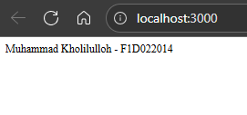
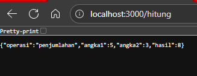
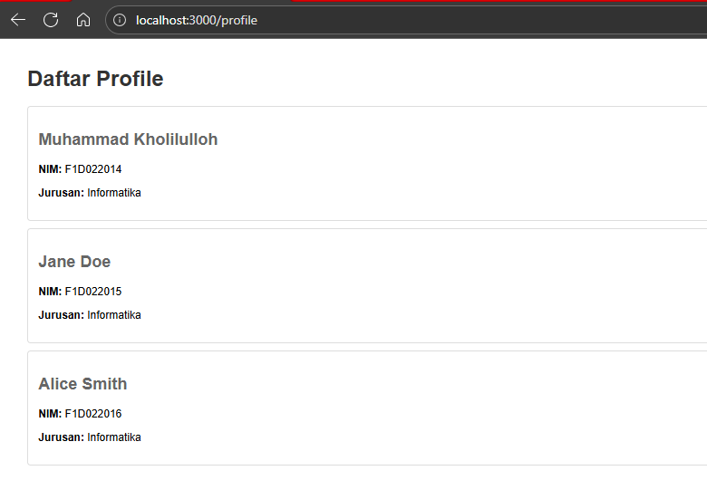
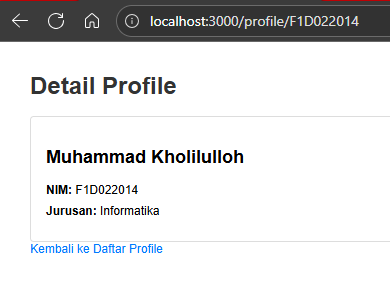

# Assignment: Express.js & Modul Node.js

## Identitas

-   **Nama**: Muhammad Kholilulloh
-   **NIM**: F1D022014

## Deskripsi Tugas

Tugas ini merupakan implementasi web server menggunakan framework Express.js dengan arsitektur modular Node.js. Proyek ini bertujuan untuk memahami konsep routing, middleware, dan modularisasi dalam pengembangan aplikasi web berbasis Node.js.

Dalam tugas ini, saya membuat aplikasi Express.js yang memiliki beberapa endpoint untuk menangani berbagai jenis request HTTP, menggunakan modul terpisah untuk operasi matematika, dan implementasi router untuk mengelola route profil pengguna.

## Hasil Screenshot dan Sedikit Penjelasan Terkait Screenshot Tersebut

### 1. **Route Utama (`http://localhost:3000/`)**



Route ini menampilkan identitas mahasiswa berupa nama dan NIM dalam format teks sederhana. Route ini berfungsi sebagai halaman utama aplikasi yang memberikan informasi dasar tentang pembuat aplikasi. Response yang dikembalikan adalah string "Muhammad Kholilulloh - F1D022014".

### 2. **Route Hitung Penjumlahan (`http://localhost:3000/hitung`)**



Route ini mendemonstrasikan penggunaan modul `math.js` untuk melakukan operasi penjumlahan. Route ini menerima parameter query `a` dan `b`, kemudian menggunakan fungsi `add()` dari modul math untuk menghitung hasilnya. Response dikembalikan dalam format JSON yang berisi detail operasi, angka yang digunakan, dan hasil perhitungan. Jika tidak ada parameter yang diberikan, maka akan menggunakan nilai default a=5 dan b=3.

### 3. **Route Profil (`http://localhost:3000/profile`)**



Route ini menampilkan daftar profil mahasiswa dalam format HTML yang sudah di-styling dengan CSS. Data profil disimpan dalam array JSON dan ditampilkan dalam bentuk card yang rapi. Setiap profil menampilkan informasi nama, NIM, dan jurusan mahasiswa. Route ini menggunakan router terpisah yang didefinisikan dalam file `routes/profile.js` untuk menjaga organisasi kode yang baik.

### 4. **Route Profil by ID (`http://localhost:3000/profile/:id`)**



Route ini merupakan dynamic route yang menggunakan parameter URL untuk menampilkan profil mahasiswa berdasarkan ID tertentu. Parameter `:id` berfungsi sebagai identifier untuk mencari data profil yang sesuai dalam array. Jika ID ditemukan, maka akan menampilkan detail profil mahasiswa tersebut dalam format JSON atau HTML. Jika ID tidak ditemukan, server akan mengembalikan response error 404 dengan pesan "Profil tidak ditemukan". Route ini mendemonstrasikan penggunaan URL parameters dalam Express.js untuk akses data spesifik.

## Penjelasan Teknis

### **Struktur Proyek**

```
week-6-expressModule/
├── index.js           # File utama server Express.js
├── package.json       # Konfigurasi dan dependencies
├── README.md         # Dokumentasi proyek
├── utils/
│   └── math.js       # Modul utilitas matematika
└── routes/
    └── profile.js    # Router untuk route profil
```

### **Endpoint yang Tersedia**

1. **GET /** - Menampilkan identitas mahasiswa
2. **GET /hitung** - Operasi penjumlahan dengan parameter query
3. **GET /hitung-kurang** - Operasi pengurangan dengan parameter query
4. **GET /profile** - Daftar profil mahasiswa dalam format HTML
5. **GET /profile/:id** - Detail profil mahasiswa berdasarkan ID

### **Modul yang Digunakan**

-   **utils/math.js**: Berisi fungsi-fungsi matematika (add, subtract, multiply, divide)
-   **routes/profile.js**: Router khusus untuk menangani route profil dengan data JSON

### **Fitur Utama**

-   Modularisasi kode dengan pemisahan fungsi ke file terpisah
-   Penggunaan middleware Express.js untuk parsing JSON
-   Response dalam format JSON dan HTML
-   Parameter query handling untuk operasi matematika
-   Dynamic routing dengan URL parameters
-   Error handling untuk data yang tidak ditemukan
-   Styling CSS untuk halaman profil yang menarik

Aplikasi ini berhasil mendemonstrasikan konsep dasar pengembangan web dengan Express.js, termasuk routing, modularisasi, dan penanganan berbagai jenis response.
